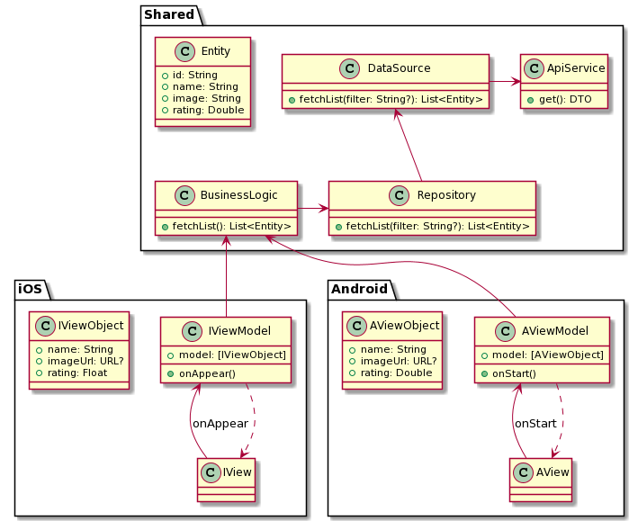

# PoC-Kotlin-Multiplatform
Proof of concept using Kotlin Multiplatform to develop shared domain module between apps for iOS &amp; Android  

  

## Architecture
This is a brief representation of the architecture used in this PoC

  

## Run app on devices

  
  

